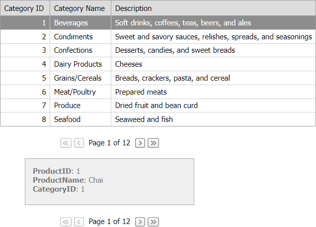

<!-- default badges list -->

<!-- default badges end -->
# Grid View for ASP.NET Web Forms - How to show detail information in the DataView control
<!-- run online -->
**[[Run Online]](https://codecentral.devexpress.com/e2529/)**
<!-- run online end -->

This example demonstrates how to use [ASPxGridView](https://docs.devexpress.com/AspNet/5823/components/grid-view) and [ASPxDataView](https://docs.devexpress.com/AspNet/8280/components/data-and-image-navigation/dataview) controls to show master-detail data. When a user selects a row in the master Grid View, the DataView control displays detail data.

Once a user changes the focused row in the grid, the [FocusedRowChanged](https://docs.devexpress.com/AspNet/DevExpress.Web.GridViewClientSideEvents.FocusedRowChanged) event occurs. The [FocusedRowChanged](https://docs.devexpress.com/AspNet/DevExpress.Web.GridViewClientSideEvents.FocusedRowChanged) event handler calls the data view's [PerformCallback](https://docs.devexpress.com/AspNet/js-ASPxClientDataView.PerformCallback(parameter)) method to send a callback to the server. 

On the server, the [PerformCallback](https://docs.devexpress.com/AspNet/js-ASPxClientDataView.PerformCallback(parameter)) method raises the [CustomCallback](https://docs.devexpress.com/AspNet/DevExpress.Web.ASPxDataViewBase.CustomCallback) event. The [CustomCallback](https://docs.devexpress.com/AspNet/DevExpress.Web.ASPxDataViewBase.CustomCallback) event handler establishes a master-detail relationship through the `CategoryID` field and updates the detail grid's data.

## Files to Review

* [Default.aspx](./CS/WebSite/Default.aspx) (VB: [Default.aspx](./VB/WebSite/Default.aspx))
* [Default.aspx.cs](./CS/WebSite/Default.aspx.cs) (VB: [Default.aspx.vb](./VB/WebSite/Default.aspx.vb))

## Documentation

- [Master-Detail Relationship](https://docs.devexpress.com/AspNet/3772/components/grid-view/concepts/master-detail-relationship)

## More Examples

- [How to show detail information in a separate Grid](https://github.com/DevExpress-Examples/aspxgridview-show-detail-information-in-separate-grid)
- [How to display a popup dialog when a user clicks a lnk in a Grid row](https://github.com/DevExpress-Examples/asp-net-web-forms-grid-display-popup-when-user-clicks-cell-link)
